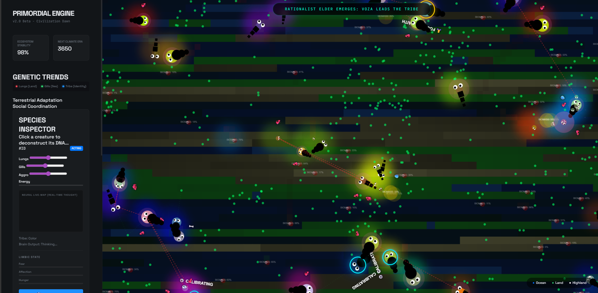

# 🌌 The Primordial Engine
### *A Beautifully Useless Planetary Life & Civilization Simulation*




> [!CAUTION]
> **DISCLAIMER**: This is a strictly useless pet project. It serves no commercial purpose, solves no real-world problems, and will likely just consume your CPU cycles as you watch digital dots grow, mate, and die in a simulated void. Use at your own risk of losing hours to digital voyeurism.

---

## 🔬 The 10 Pillars of Biological Realism
The engine now features deep biological mechanics that make it the ultimate "useless" nature documentary.

1.  **♂♀ Sexual Selection**: Distinct Male/Female genders with physical dimorphism.
2.  **🤰 Pregnancy**: Gestation periods where mothers move slower and burn extra energy.
3.  **🛡️ Parental Care**: Mothers stay near and actively guard their young larvae.
4.  **💤 Circadian Rhythms**: Diurnal creatures sleep at night; nocturnal predators hunt them.
5.  **🔴 Visible Chases**: High-tension hunting lines connection hunters and their prey.
6.  **💀 Scavenging**: Dead bodies leave persistent carcasses that scavengers can feed on.
7.  **👴 Aging (Senescence)**: Elderly creatures suffer from metabolic failure.
8.  **🌱 Fertile Biomes**: Food blooms preferentially on coastlines and fertile land.
9.  **🧠 Spatial Memory**: Creatures remember and return to their last 3 food locations.
10. **🌊 Seasonal Cycles**: Global food availability shifts between Spring blooms and Winter famines.

---

## 🧬 Core Biological Simulation
The engine simulates life at a genomic level, moving beyond simple "dots on a screen."

- **Mendelian Inheritance**: Every agent possesses a double-allele genome. Recessive traits can skip generations.
- **Morphogenesis (Metamorphosis)**: Life begins as high-vulnerability **Larvae** that must survive for 500 days before undergoing a physical transformation into adult segmented forms.
- **Trophic Web**: Intelligent dietary archetypes—**Grazers, Hunters, and Omnivores**—compete for resources. 

## ⚖️ The Struggle & Scarcity Update
The simulation enforces brutal realism. There are no artificial safety nets.

- **Global Biomass Law**: Food does not spawn endlessly. The total energy in the entire planet is strictly capped. If populations explode, famine naturally follows.
- **The Fertility Grid**: Over-foraging permanently damages the land, creating barren "Wastelands".
- **Rot & Decay**: Dead bodies that aren't eaten by scavengers decay into toxic Rot, permanently poisoning the surrounding environment.
- **Extreme Lethality**: Biomes are lethal. Small creatures freeze to death in global Ice Ages; massive creatures suffer heatstroke in Solar Flares. Adapt or go permanently extinct.
- **Chain Extinctions**: When a dominant genetic lineage is wiped out, the world logs the extinction forever. They do not come back.

## 🏛️ Civilization Dawn: Roles & Society
When creatures reach adulthood (500 days), they are assigned distinct societal roles based on their genetics:

1. 📦 **The Gatherer** (Herbivore): Collects food and returns it to the Tribal Cache to sustain the village.
2. ⚔️ **The Soldier** (Aggressive): Protects the village borders and drives out rival tribes.
3. 🏹 **The Hunter** (Carnivore): Actively hunts prey and carries "Meat" back to the Tribal Cache rather than eating it immediately.
4. ✨ **The Prophet** (High Spirituality): Emits shimmering energy fields that restore energy to nearby tribe members.
5. 🌾 **The Farmer** (Low Aggro/Herbivore): **[The Agricultural Revolution]** Seeks out barren Wastelands and spends their own energy to "till" the soil, restoring fertility and manually planting crops. Wealthy farmers can pioneer new Village Caches in distant lands.
6. 💊 **The Healer** (Empathetic): **[The Era of Medicine]** Draws harvested Medicinal Herbs from the village cache to cure tribe-mates suffering from the Fever.

## 🦠 The Era of Medicine
A lethal internal system constantly threatens the world.

- **The Fever**: A horrific viral plague that burns massive energy, slows agents down, and renders them in a sickly green aura. It spreads rapidly near rotting carcasses.
- **Herbalism**: Gatherers and Farmers have a small chance to yield `Medicine` when foraging or tilling the land, which they stockpile in the Village Caches.
- **Immunity**: If a Healer successfully cures a sick agent with Medicine, or if an agent naturally survives to old age with the disease, they gain permanent Natural Immunity.

## ⚡ Divine Intervention & AI (You)
You are the **Creator.** You do not just watch; you interfere.

- **LLM Consciousness**: Powered by local `gemma3:12b` via Ollama. Click an agent to read its internal monologue as it analyzes the environment, feels fear, and strategizes for survival.
- **Divine Possession**: Press **"P"** to inhabit any creature. Use **WASD** to lead your tribe, hunt rivals, and survive the world yourself.

---

## 🛠️ Controls
- **Click**: Spawn Nutrient Cloud.
- **"P"**: Possess/Take Control of Selected Agent (WASD Move).
- **"H"**: Toggle Cinematic Mode (HUD Hide).
- **"Climate Shift"**: Manually trigger a planetary era shift.

---

---

## 🚀 How to Run

1.  **Start the Server**:
    - Run the provided batch script to start a local Python web server:
      ```powershell
      .\run_simulation.bat
      ```
2.  **Access the Simulation**:
    - Open your browser and navigate to: [http://localhost:8000](http://localhost:8000)

## 🔮 Ollama AI Integration

To enable the "LLM Consciousness" for your creatures:

1.  **Ensure Ollama is running**: `ollama serve`
2.  **Pull the Model**: The engine is configured to use `gemma3:12b` (or `tinyllama`).
    ```bash
    ollama pull gemma3:12b
    ```
3.  **Activate in Sim**:
    - Click the **🔮 Consciousness** button in the "GOD MODE" sidebar.
    - Select a creature to observe its internal monologue and goals.

---

### *Waste your time today. Watch the void breathe.*
> **Running on: http://localhost:8000**
